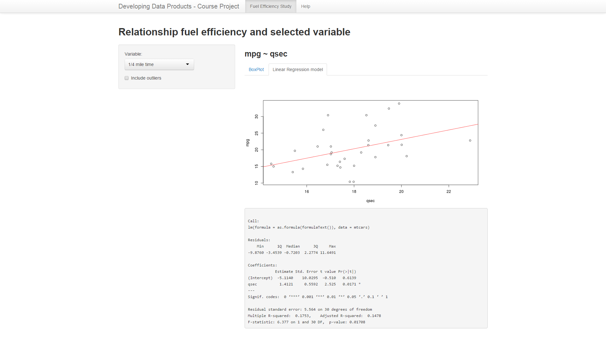

ShinyPresentation
========================================================
author: voilamochu
date: 12/21/2014
width: 1600
height: 900
Goal of the presentation
========================================================

This presentation aims to provide an overview of the Shiny app I developed as a part of my course [Developing Data Products.](https://www.coursera.org/course/devdataprod) 

Application description
========================================================

The application aims to provide some exploratory analysis of the mtcars data set. The objective of the analysis is to study the impact of a variety of variables on fuel efficiency. 

Towards this end, the app displays the box plot of a selected variable agianst fuel efficiency. It also provides a linear regression line with summary statistics of the model (with fuel efficiency as the dependent variable and the selected variable as the independent variable).

The application is available at [https://voilamochu.shinyapps.io/ShinyProject/] (https://voilamochu.shinyapps.io/ShinyProject/)

Screenshot of the app
========================================================



A sample regression model of the sort presented by the tool
========================================================


```r
fit <- lm(mpg ~ qsec, data = mtcars)
summary(fit)
```

```

Call:
lm(formula = mpg ~ qsec, data = mtcars)

Residuals:
    Min      1Q  Median      3Q     Max 
-9.8760 -3.4539 -0.7203  2.2774 11.6491 

Coefficients:
            Estimate Std. Error t value Pr(>|t|)  
(Intercept)  -5.1140    10.0295  -0.510   0.6139  
qsec          1.4121     0.5592   2.525   0.0171 *
---
Signif. codes:  0 '***' 0.001 '**' 0.01 '*' 0.05 '.' 0.1 ' ' 1

Residual standard error: 5.564 on 30 degrees of freedom
Multiple R-squared:  0.1753,	Adjusted R-squared:  0.1478 
F-statistic: 6.377 on 1 and 30 DF,  p-value: 0.01708
```
